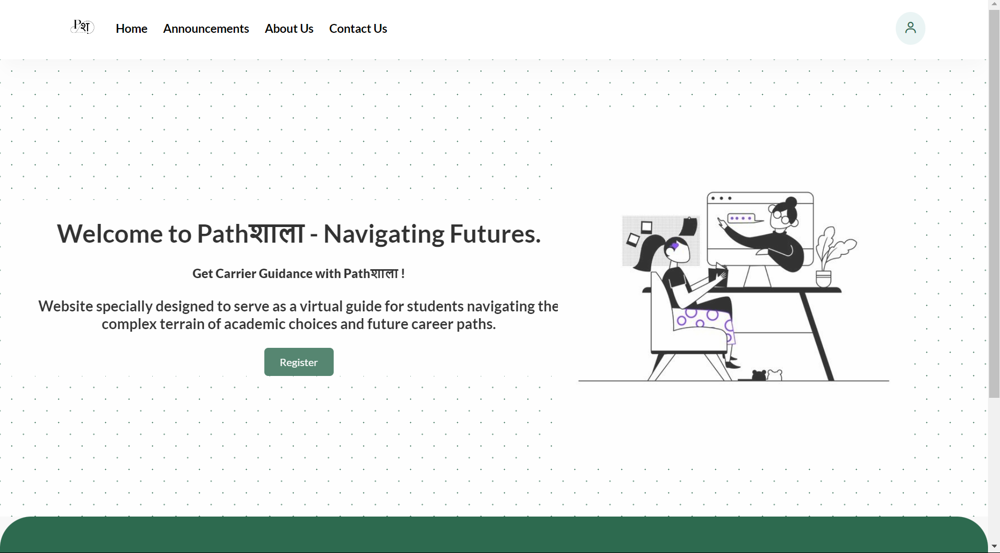

# Pathशाला - Navigating Futures

##  ABSTRACT
"Pathशाला - Navigating Futures" is a pioneering online educational platform developed by our dedicated team of four. Our project is designed to serve as a virtual guide for students navigating the complex terrain of academic choices and future career paths.

**The main agenda of this project is:**
1. 📝 To revolutionize the educational journey by leveraging interactive tools, personalized guidance, and a wealth of information on diverse subjects and professions.
2. 📝 Pathशाला is set to empower students with the knowledge and insights needed to make informed decisions about their future educational journeys.

## 🔗 Links

 - [Github Link](https://github.com/Namsrkive/Pathshala/tree/main)
 - [Website Link]()

## 🛠 Skills
HTML, CSS, JavaScript, Git

# Screenshot
Here we have the project screenshot :

